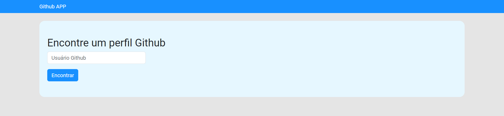
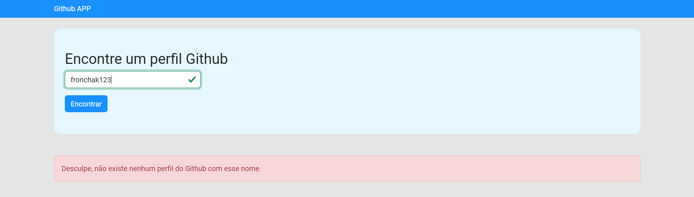

# Github APP
An aplication to search for a github account based on its name

## [Click here](https://github-app-fronchak-projects.vercel.app) to go the project page

## Requipements
* Node 18
* Npm 9.8

## How to Use
1. Clone this project to your machine
2. Open your terminal in the project's folder
3. Run the following command: 'npm install' to install all the dependencies
4. Run 'npm run dev' to initialize the project
5. Open your browser in the 'http://localhost:5173' to see the home page

## Images

### Home page

### Seach page

### Successful search

### Profile not found

